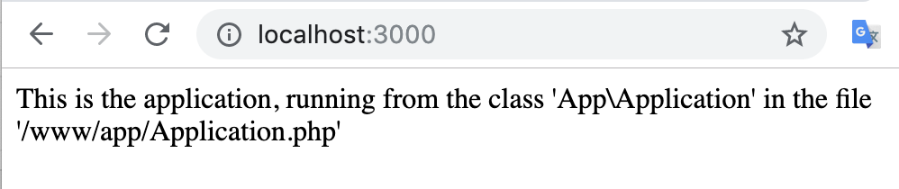

# simple-easy-nginx-php
This repository will easily allow you to quickly run a nginx/phpfpm with volume mounts from your local machine, allowing you to easily get started writing your first website, or even form the basis of a simple project you want to start

## Getting Started

1. Run `composer install`
    - This will install any dependencies you have, already I have setup the tests for you to start working on those
    - It will also copy the `.env.dist` to `.env` so your application has a starting set of environment variables that you can modify
    
2. Edit the `.env` file which is created
    - The `.env.dist` file is a template with all the defaults, you shouldn't edit this
    - The `composer install` command will copy `.env.dist` to `.env` for you automatically
    - Change any values you think you need to in the `.env` file to match your system accordingly

3. Run `docker-compose build`
    - This will build all the containers

4. Run `docker-compose up`
5. Open your browser to `localhost:3000` to see the application running. Like in the screenshot here
    

## Benefits of this over XAMPP, WAMP, or similar

- Docker allows you to build isolated conainers of software and all the instructions are written into source code files 
    which can be uploaded to your git repository
- This means, you don't just create your app, you also create HOW TO RUN you app, all inside the source code
- Any changes to your website configuration are stored inside the source file, you commit these changes

## ***** BE CAREFUL OF STORING PASSWORDS *****

I cannot stress enough if you add passwords to these files and commit them, anybody who can read your git repository, can get your passwords

This is the reason why there is a seemingly useless `.env.dist` file which gets copied to `.env`. 

Maybe you are thinking: Why do this? What is the purpose? Why not just create a `.env` file, right?

If you are thinking about these things, then realise that the `.env.dist` file does not contain any secrets and the gitignore is configured to not commit changes from your `.env` file. 
This means if you edit the `.env` file, you'll never accidentally upload these secrets to git.

So this seemingly useless `.env.dist` file, has a very important purpose. 

** PLEASE DO NOT REMOVE `.env` from the `.gitignore` file **

## Nginx

Nginx will `serve` the project to the browser and the `/public` folder is the application entry point.
Edit the `public/index.php` file to load your php application. There is a sample inside the `index.php` file 
ready for you to edit. 

## PHP

PHP runs because Nginx passes php scripts to the phpfpm engine to be executed. It's the simplest docker setup that you 
can really start with which gives you all the power that you need. But there are some things to keep in mind

1. Inside the docker container, your application root directory, is mounted into the `/www` directory
    - This means if you see paths like `/www/App/Application.php` then the `/www` part is your application 
    directory on your computer
    - This can be tricky if you're not used to docker, but this is how containers work. You isolate programs into 
    black boxes, similar to virtualbox or vagrant, but much more efficient
2. File permissions can be tricky, symfony is very picky about file permissions
3. You could easily install lumen or anything into this container and it should work without much extra effort.

## Postgres database

I added a postgres database to the setup because I figured you might want an example which can let you work with a database.
If you don't want this, you can just delete it from the `docker-compose.yml` file and remove the postgres environment variables
from the `.env` file and it will be removed. 

Change the settings of the environment variables in order to make the user, password, and database that you want.

It will be available for you on `localhost` if you try to connect from your php code